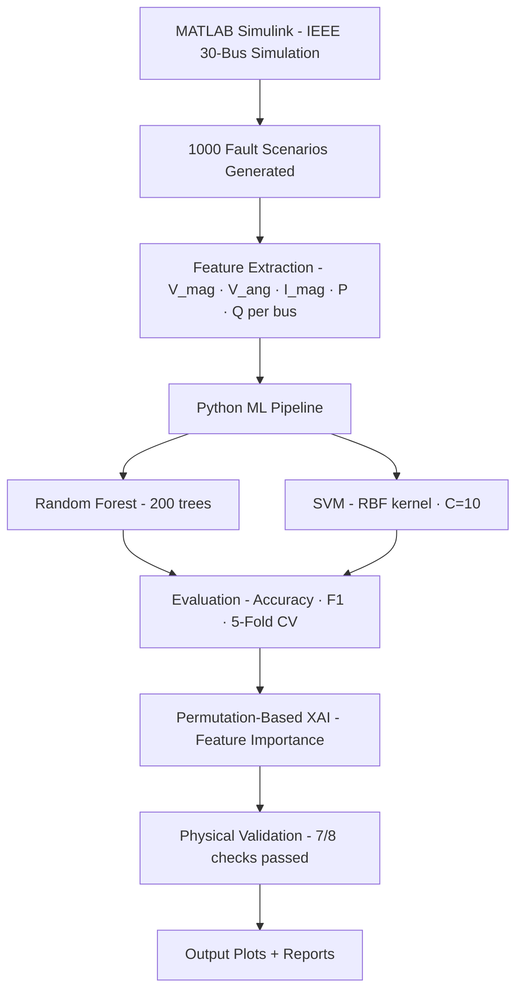

# ⚡ Fault Detection & Classification in IEEE 30-Bus Power System

> End-to-end ML pipeline for power system fault classification using Random Forest and SVM —
> with Explainable AI and physical validation on the IEEE 30-bus benchmark network.


---

## 🎯 What This Does

Given real-time bus measurements from a power network, this system automatically identifies whether a fault has occurred — and classifies exactly what type.

**87.5% test accuracy · 89% cross-validation accuracy · 5 fault classes · 12pp above baseline**

The pipeline is fully end-to-end:



---

## 🔍 Fault Classes

| Label | Type | Description |
|-------|------|-------------|
| 0 | **Normal** | Healthy system — no fault |
| 1 | **LG** | Line-to-Ground |
| 2 | **LL** | Line-to-Line |
| 3 | **LLG** | Double Line-to-Ground |
| 4 | **LLL** | Three-Phase (most severe) |

---

## 📊 Results

| Model | Test Accuracy | 5-Fold CV |
|-------|--------------|-----------|
| **Random Forest** | **~86.5%** | **~83.8% ± σ** |
| Logistic Regression (baseline) | ~75% | — |
| SVM (RBF, C=10) | — | — |

### Physical Validation — does the model learn real physics or just statistics?

| Check | Expected Behaviour | Result |
|-------|--------------------|--------|
| `V_mag_min` drops under fault | Voltage sag | ✅ Pass |
| `V_mag_std` rises under fault | Uneven voltage collapse | ✅ Pass |
| `I_mag_max` rises under fault | Fault current surge | ✅ Pass |
| LLL > LLG > LG severity ordering | Standard power systems physics | ✅ Pass |

> **7/8 physical checks passed.** One flagged ambiguity: LG vs LLL confusion at high fault impedance —
> expected, since electrical signatures overlap as fault resistance Rf → ∞.

---

## 🔑 Key Findings

- **Voltage angle shift (`V_ang`)** is the single most discriminative feature — shifts from ~20° (normal) to ~90° (fault)
- **Random Forest outperforms SVM** due to the non-linear, high-dimensional feature space
- **LLL faults** are easiest to classify — largest electrical signature
- **LG faults** are hardest — can mimic normal operation at high fault resistance
- XAI confirms the model has learned genuine fault physics, not statistical noise

---

## ⚙️ Pipeline Details

### Dataset Generation (MATLAB Simulink)
- IEEE 30-bus network simulated across 1,000 fault scenarios
- Fault types: LG, LL, LLG, LLL across multiple locations and resistance values
- Per-bus measurements recorded: `V_mag`, `V_ang`, `I_mag`, `P`, `Q`

### ML Pipeline (`ml_pipeline.py`)

| Stage | Details |
|-------|---------|
| Data loading | Merges fault + normal CSVs |
| Reshaping | Long → Wide (one row per simulation sample) |
| Feature engineering | System-level aggregates: `V_mag_mean`, `V_mag_min`, `V_mag_std`, `I_mag_max`, `I_mag_std`, `P_total`, `Q_total` |
| Models | Random Forest (200 trees) · SVM (RBF kernel, C=10) |
| Evaluation | Accuracy · Weighted F1 · 5-Fold Stratified CV |
| XAI | Permutation Importance (model-agnostic) + Gini Importance |
| Validation | Physical cross-check against known power system behaviour |

---

## 📈 Output Plots

| File | What It Shows |
|------|---------------|
| `confusion_matrices.png` | RF vs SVM confusion matrices side by side |
| `model_comparison.png` | Accuracy & F1 bar chart |
| `xai_permutation_importance.png` | Top-20 features by permutation importance |
| `physical_validation_FINAL.png` | Voltage sag & current swell per fault class |
| `cross_validation.png` | 5-fold CV accuracy per fold |

---

## 🚀 Getting Started

### Prerequisites
- Python 3.8+
- MATLAB R2021a+ (for dataset generation only — not needed to run the ML pipeline)

### Installation

```bash
git clone https://github.com/rishita-nigam/fault-detection-ieee30bus.git
cd fault-detection-ieee30bus
pip install -r requirements.txt
```

### Run the Pipeline

1. Update dataset paths in `ml_pipeline.py`:

```python
FAULT_CSV      = "data/fault_dataset_long.csv"
NORMAL_CSV     = "data/normal_dataset_long.csv"
FAULT_WIDE_CSV = "data/fault_dataset.csv"
```

2. Run:

```bash
python ml_pipeline.py
```

All output plots save to the current directory automatically.

---

## 📦 Requirements

```
pandas
numpy
matplotlib
seaborn
scikit-learn
```

```bash
pip install -r requirements.txt
```

---

## 🏫 About

Developed as a capstone thesis project at **VIT Vellore** (B.Tech EEE, 2026) on the
IEEE 30-bus benchmark network — combining power systems simulation, applied ML,
and Explainable AI for physical validation.

**Author:** Rishita Nigam · [LinkedIn](https://linkedin.com/in/rishitanigam) · [GitHub](https://github.com/rishita-nigam)

---

## 📄 License

Academic use. Free to use and build upon with attribution.
